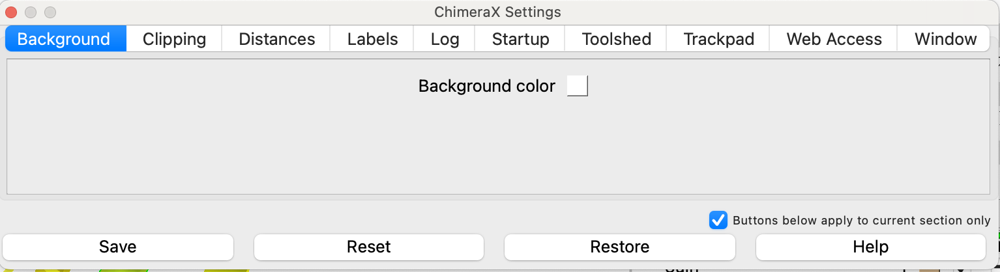
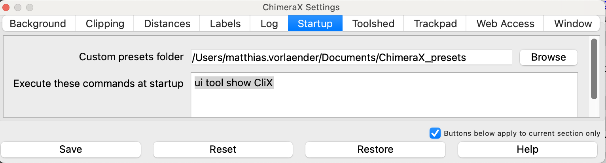
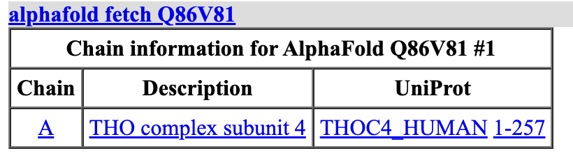
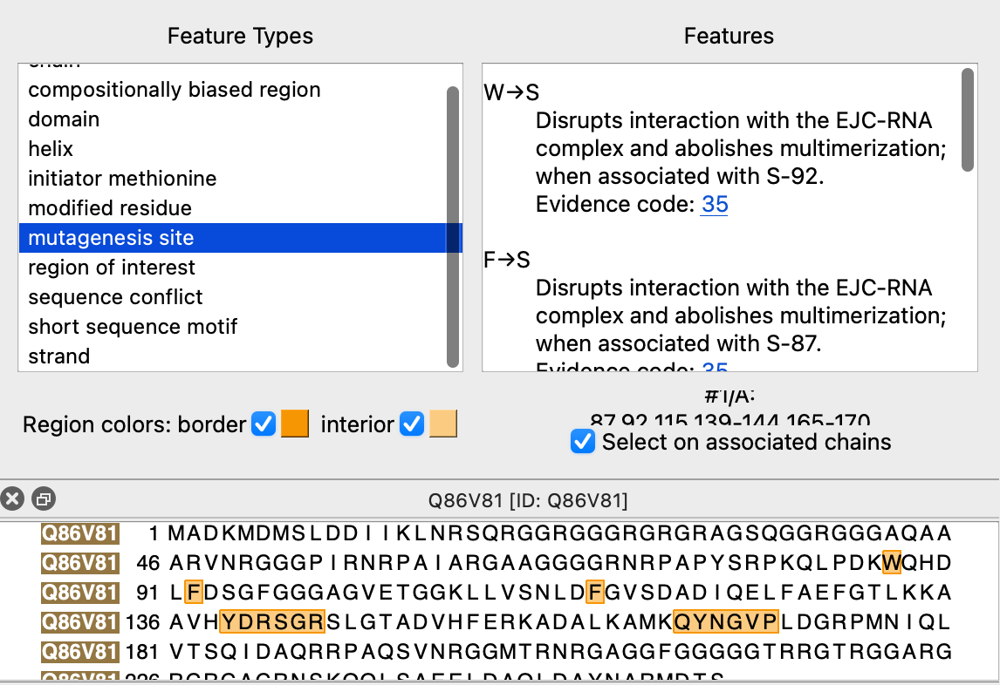
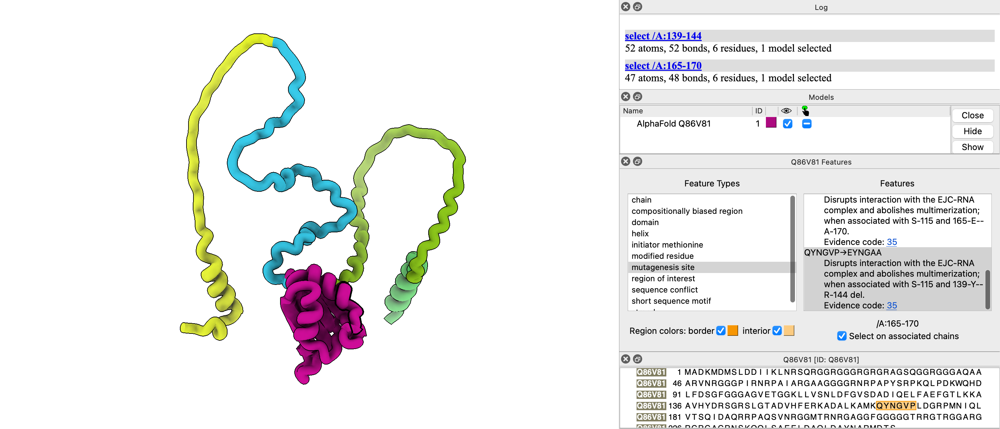

# ChimeraX Tutorial
 
Matthias Vorländer, January 2025, VBC
matthias.vorlaender@imp.ac.at

### Quick start

The fastest way to visualise yout AF prediction is to download the analysis scripts from [here](https://github.com/mvorlander/HDYDI_ChimeraX/tree/main/ChimeraX_AF_scripts) and read the instructions in the readme files for installation. **The installation is straight forward!** The scripts will load the five predictions from an AF run, associate the JSON file to each, identify interface residues and write them to files, and generate a slider to easily browse through and compare the different predictions. 
Seperate scripts (with idnetical functionality) are available to support the file formats generated by
- the alphafold 3 web server
- the results of an alphafold 2 screen as implemented by Dominik Handler (The script will analyse one hit at a time) 
- the `auto-alphafold.sh` script by Jurah Ahel


### Resons why ChimeraX is the best
> - It is beautiful and lightening fast – and free!
> - Easy to install, essentially bug-free (and if, they are usually fixed within 24h of reporting them)
> - Wide range of functions beyond displaying PDBs and ddensity display
> - Structure-to-sequence mapping and manipulation
> - Excellent alphafold features
> - Database queries 
> - Great extensions for
> - -  model manipulation and model building (ISOLDE, Interfaces to phenix and modeller)
> - - Crosslinking data and cryo-ET
> - - propably more that I don't know about
> - Very actively maintained – make sure to update regularly and check for new [features](https://www.rbvi.ucsf.edu/trac/>ChimeraX/wiki/ChangeLog)
> - Excellent [Documentation](https://www.cgl.ucsf.edu/chimerax/docs/user/index.html) 
> - Phantastic user support – answer every question and happy to implement new features upon request
> - Customizable and extendable
> - Scriptable for reproducible analysis and figure making
> - Open source and written in python – if you don’t like something, ask ChatGPT to change it
 

## General info and getting started
ChimeraX is a powerful and versatile program and we can only cover a fraction of its many functionalities! Rather then an extensive learnign resources, this is meant to make you aware of iuseful commands for follow-up  :)
General guidelines for learning are:

> - Please use its extensive  [documentation](https://www.cgl.ucsf.edu/chimerax/docs/user/index.html), or search the ChimeraX [mailing list](https://mail.cgl.csf.edu/mailman/archives/list/chimerax-users@cgl.ucsf.edu/) for further information. The developers offer excellent user support and are happy to implement new functionalities upon user suggestions!
> - Several tutorials are available [here](https://www.rbvi.ucsf.edu/chimerax/tutorials.html)
> - ChimeraX is very actively developed and regularly updated with new features. Try and keep your installation up to date!
> - In addition to core functions, ChimeraX can also run python code. Specific examples are collected [here](https://rbvi.github.iochimerax-recipes/)
> - Another introductory tutorial from Ricardo Righetto (Biozentrum Basel) can be found [here](https://docs.google.com/document/d/15v0dm-J0kwD6oTIsQ2R06c393cfJJe9bh7EM0HY9WkE/edit?tab=t.0#heading=hmudxcfn4dkjr)
> - A set of very useful customisations and shortcut buttons can be found [here](https://github.com/olibclarke/chimerax-trimmings)
> - Don't worry too much about memorising exact command syntax: Learn how to quickly open the help page in the log instead
> - Unfortunately, ChatGPT kinda sucks for knowing ChimearX syntax. Claude Sonnet works better, especially if you give it the link to the chimeraX help page of the command you are trying to use (get a ChatLLM account from Ronny ;-) ).

Info about this tutorial:
```
This is a code block. You can copy me when thius tutorial is opened in a browser, or click on me when this tutorial is opened directly in ChimeraX
```

Since this was written on a mac, shortcuts and path formats (/ vs \\) are formatted for Mac. Sorry windows world :(

>Note: This Tutorial was tested for ChimeraX 1.9, make sure to have at least this version installed!
---

# Setting up your ChimeraX

ChimeraX is an extendable program and can be customised to your preferences, whic will make using ChimeraX so much more fun!

### Browsing and installing extensions

ChimeraX extensions are available through the "Toolshed" and installation is very straightforward. You can access the Toolshed through the toolbar: `Tools/ More tools`. Popular extensions include *Isolde*  for structure refining, *ArtiaX* for electron tomography, and *XMAS* for protein-crosslinking data display. 

> **💡 Tip:**
> The *clix* bundle provides an improved command line tool and offers  auto-complete functionality and live preview of all available options for a command you are typing

###  Editing ChimeraX preferences

You can customise your ChimeraX through the Preference menu. Here are my recommendations to set up once you installed ChimeraX:

>Note: For power-users, [here](https://github.com/olibclarke/chimerax-trimmings) is a great set of customisations from Oli Clarke!

Open the Preference menu (shortcut: `⌘+ ,`) and change the following:



- **Set the default background color to white**

Most users prefer a white background to match a typical figure display. You can do this in the first tab.


- **Set a folder for custom presets and ChimeraX scripts**
The way structures are displayed is highly customisable, and most users (or labs) tend to prefer their own style. For consistency, these styles should be saved in script files (`my_style.cxc`). Similarly, you should define a color code for your protein of interest in a script if you are preparing figures for a talk or paper. You can quickly apply yoyur favourite styles by placing the `.cxc` files into a preset folder which you specify in the `startup` tab. These preests will then appear in the `Presets` menu in the toolbar. Alternatively you can apply them from the command line with the command `preset my_custom_style`.



Here is an example style script that you could save under my_style.cxc in your Custom preets folder:


>#Script name: cylinders
>#General Settings
>graphics selection color black width 5
>hide
>show nucleic
>hide protein|solvent|H
>surf hide
>
>#Display Styles
>style (protein|nucleic|solvent) & @@draw_mode=0 stick
>size protein stickRadius 0.3
>size nucleic stickRadius 0.5
>show cartoon
>cartoon style ~(nucleic|strand) x round
>cartoon style (nucleic|strand) x rect
>cartoon style modeH tube
>
>#Lighting and Camera
>lighting shadows false
>light soft
>camera ortho
>
>#Silhouette Settings
>graphics silhouettes true
>graphics silhouettes depthJump 0.1
>
>#Centering and Pivot
>cofr center showpivot false
>
>#Window Configuration
>windowsize 800 800
>
>#Background and Nucleic Acid Styling
>set bgColor white
>nucleotides fill
>style nucleic stick

- **Save aliases for complicated and long commands in the startup**
If you have a command that you use all the time, give it an alias and paste into the Startup commands. 
For example, we will be using the command `mutationscores define avg fromScore amiss setAttribute true combine mean mutationSet #1`. Yikes! Instead, you create a shortcut `my_abbreviation` and save the line below in the startup:
 `alias my_abbreviation mutationscores define avg fromScore amiss setAttribute true combine mean mutationSet #1`. 
That looks even worse, but luckily you don't need to remember it, because now you just type `my_abbreviation` from this day on.

>**Tip:** If you just want a reminder of the syntax instead of executing it, add an `echo` after `my_abbreviation`:
`alias my_abbreviation echo "mutationscores define avg fromScore amiss setAttribute true combine mean mutationSet #1`"

You can also save aliases to run more complex scripts in the startup:
`alias run_myscript runscript /path/to/my/subfolder/of/the/project/where/I/saved/the/script.cxc`. Now, you just type `run_myscript`. 

- **Define the tools you want to see upon startup**
If you would like certain commands or tools to be launched automatically, you can define them in the `startup` tab as well. For example, I recommend installing the enhanced Command line tool `Clix`, and launch it by putting `ui tool show CliX`  in the `Execute these commands at startup` field 

- **Restore window size when opening sessions** 
In the preference menu, under `Window`, tick `Resize graphics window on session restore'. This is important for a consistent size of saved images when you re-open a ChimeraX session and update the rendering for your paper figure.

---

## Mini tutorial 1  -  Exploring your protein of interest using database queries 

Scenario: Lets assume you found a hit in your mass-spec data and know nothing about it other then its uniprot ID. We can use ChimeraX as a great starting point to have a first look.

### First, let's set our workind directory (this saves us a lot of typing!!)

Lets tell ChimeraX where to save outputs and where to look for inputs: (or use the Menu `File / Set Working Folder...`)


```
cd browse
```

### Loading the alphafold model and PAE plor

In this tutorial, we are going to look at the mRNA export adaptor ALYREF (also known as THOC4) with the uniprot ID Q86V81 and take some images along the way. 

 or in the toolbar, select `File \  Set Working folder`

To load the prediction, type:

```
alphafold fetch Q86V81 pae true
```

> **💡 Tip:**
> If you are new to the ChimeraX command line and scripting, notice how every action that the log window displays the corresponding command that you execute, no matter if through the toolbars or the command line! You can copy and paste them into a text file and save it as a .cxc script that you can run by double-clicking.


This will give us this screen and a new window containing the PAE plot:


> **💡 Tip:**
> - Note the buttons for coloring the structure by pLDDT score, or by PAE domain! Click the help button for more information!
> - You can select residues in the structure by dragging in the PAE plot!


### Inspect annotated regions 
ChimeraX allows you to select regions that have been functionally annotated by uniprot directly. For this, scroll up in the log window until you find the *Chain information for AlphaFold Q86V81 #1* block. Now click on the Uniprot name in the table
 
This will open two new windows: A sequence viewer, and a feature viewer. Clicking on any annotated feature in the Feature viewer will highlight the corresponding residues in the sequence viewer and will select the residues in the structure viewer.


You can also type
`open Q86V81 fromDatabase uniprot associate #1/A` to associate uniprot data with any other model.
This will associate the uniprot info to chain A in model #1.

>**Note**: your model does not have to be from the alphafold database, you could still associate a structure to a model that you for example build yourself!

### Change the display style
I will next apply one of my custom display presets to the structure, increasing the visibility of the random coil elements

```
preset custom "thick ribbons"
```

The structure now looks like this.


This looks pretty, let's save a picture:

```
save domains.png tr true
```

>**Tip:** 
>- ChimeraX accepts shorts forms for many commands and arguments, here I abbreviated "transparency"  with "tr'. This generates a transparent background in the rendered images. Similarly, type "c" instead of "cartoon", "a" isntead of "atoms", "s" instead of "surface" ect...
>- Because we set a working folder earlier wiht the `cd` command, we don't need to specify the full path where the image should be saved!


### Visualizing AlphaFold Missense Mutation scores 
 
 Next, let's load alphafold missense scores and visualise the predicted pathogenicity onto the strucutres.
 >**Notes💡** 
 > - Alpha Missense scores are a great way to quickly identify  potential functionally important regions of your POI, as regions with high pathogenicity score are often involved in specific protein-protein contacts! 
 > - only avaible for human proteins :-( If you work with a differnet species, it might till be worth to check the human proteins and check conservation in your species! 


**1. Load Missense Mutation Data**

```
open Q86V81 fromDatabase alpha_missense format amiss
```

This fetches predicted effects of all possible amino acid substitutions for our protein. The data is a matrix with a score for each amino acid subsitutition, for more information, check [here ](https://alphafold.ebi.ac.uk/faq#faq-22).

Alternatively, use the shortcut cmd +f to fetch the missense data:


**2. Associate Mutation Data with Structure**

```
mutationscores structure #1
```
This links the mutation data to our 3D structure so we can visualize it.

**3 Label the residues with missense scores**
We use the 

```
mutationscores label #1 amiss height 3 palette bluered
```

From this, we get:


And if we zoom in we can see the complete substitution matrix superimposed onto the residues:


How cool, is that?? But perhaps a little busy. let's instead create a color mapping of the *average* pathogenicity score (mean over all possible substitutions.) For this, we need to calculate a new mutation score, that we will name `avg`, using the command:

```
mutationscores define avg fromScore amiss setAttribute true combine mean
```
Tip: That is a bit clunky, if we dont want to remember this command, let's define a shorthand using the `alias` command:

If we want to use this data perhaps for plotting, we can save the attribute values to a value. The new attribute we created is called `avg`, so we can do

**4. Color Structure by Mutation Sensitivity**
let's color the structure by our new attribute


```
color byattribute r:avg #!1 palette bluered key true
```

This colors the structure based on mutation sensitivity:
- Blue: Less sensitive to mutations
- White: Moderately sensitive
- Red: Highly sensitive to mutations

In addition  we can also render the cartoon thickness proportional to the missense score

```
cartoon byattribute r:avg #!1 
```

It is getting a bit busy, let's remove the labels:


```
label delete
```


Note, instead of the command, you can also use the user interface 

This varies the thickness of the protein backbone based on mutation sensitivity, making highly sensitive regions more prominent.


What a stunning piece of art. Let's save a picture (this time at a higher resolution by specifying a small pixel size and super-sampling)

```
save missense_worms.png supersample 4 tr true pixelSize 0.1
```


```
save ALY_mutations_scores.defattr attrName avg 
```

Note how a short stretch in a disordered region, as well as the two terminal helices and the central folded domains are dark red, potentially indicating the involvement in functionally important protein-protein contacts!

>Tip: if you find the coloring of POIs for your project useful, I wrote a script that is simple to run and returns a ChimeraX script to automate the steps leading to a strucutre colored by missense value, which can be a bit faster and can process multi-chain PDBs efficiently:
`Generate_AF2_missense_color_map.sh --uniprot Q86V81`
`Generate_AF2_missense_color_map.sh --pdb 7NZK`
You can find the code on [my github page for this tutorial](https://github.com/mvorlander/HDYDI_ChimeraX) and/or get in touch with me directly.

### Make a reusabel script

Now one can reasonably br expected to remember all of these steps by heart. Luckily, we can make a reusable script that take a uniprot ID and a model ID as arguments and execute the workflow!. 

>**Brief explanation**: for a re-usable script, the user calls the script together with positional arguments. So on the script below, the first argument the user types after the script name will be used instead of `$1`, and the seconed argument will be used instead of `$2`, and so on. We added the keywords `mutationSet  $1` in several places, because if the script is used multiple times in a session, ChimeraX needs to know which mutations set to use

>#map_missence.cxc
>echo Usage: runscript mappisense [uniprot-id-to-fetch-scores-from] [chain-ID to apply mapping to]
>alphafold fetch \$1
>#get the missense data 
>open \$1 fromDatabase alpha_missense format amiss
>#associate missense data to structure
>mutationscores structure \$2 mutationSet  \$1
>#label each residue with matric
>mutationscores label \$2 amiss height 3 mutationSet \$1
>#define a new score called avg by avergaing over all substitution scores
>mutationscores define avg fromScore amiss setAttribute true combine mean mutationSet \$1
>color byattribute r:avg \$2 target csab palette bluered range full
>#scale cartoon by acg missense score
>cartoon byattribute r:avg \$2

let's save this file into our ChimeraX presets folder (or any other folder you like), and create an alias to call the program:

```
alias map_missense runscript /Users/matthias.vorlaender/Documents/ChimeraX_presets/map_missense.cxc $1 $2
```

so from now one, you can type

```
map_missense Q86V81 #1
```

to execute the entire workflow.

### Investigating regions with high pathogenicity scores

Fr this example, let's focus on the C-terminal region that pops up in our pathogenicity color mapping. For this, let's select the residues either from the sequence viewer

> **💡Tip:** By hovering over a residue, you will see the residue identifier pop up

Select the C-terminal helices with high pathogenicity score, either by using the sequence viewer, by clicking control-shift and mouse dragging in the structure window, or with the command:


```
select #1/A:239-257
```

After selection, let's name this selection:

```
name frozen cterm sel
``` 

>**Note**: the addition of the `frozen` keyword  means that the naming will only apply to the currently selected residues, no matter if our active selection changes!


Let's take look closer at some  properties of our selected region.

- *show sideshains*
  ```
  show cterm atoms
  ``` 
  
  or just (`show cterm` or `show cterm a`)

- *label sidechains*
  `label cterm`
 
 ``` 
 label sel
  ```

- *create a copy of the molecule to apply different coloring, for example using a color gradient from N to C term:
```
combine #1
```
```
rainbow #3 
```
Ok, let's close the second copy
```
close #3
```


## Blast the selected residues to search for homologs

To search if this C-terminal helix motif is present in other proteins, we can perform a BLAST search directly through ChimeraX. By typing

```
blast cterm database pdb
```
we are submitting a blast job to a webserver.

 >**💡 Note:**
>-Open the user interface (Tools/Sequence/Blast Protein) to see all options, or type `blast` and click on the command in the log!
>-The ChimeraX blast tool does not support limiting the BLAST search to a single species!
>-To search the entire alphafold database for structure homologs of your proteins, use the tool "Similar Structures", which performe very fast strucutre based searched of all 200 million Alphafold models!

```
ui tool show "Similar Structures"
```

## Analyze the blast results

We will next select one of the PDBs from the BLAST result and visualise the interfaces between our ALYREF and its binding partners. For this, we will pick PDB 7ZNJ, which contains a hexameric assembly of ALYREF bound the trimeric Exon-junction complex. We can select this from the BLAST tool result that pops up when the search has finished. Click on the hit form the BLAST window, and then on the `Load Structures` button.

### Adjusting the colors and display style


>Tip💡: To adjust the zoom level to see all displayed models compeltely, type `view` in the command line

The ChimeraX default display is applied to every new structure that is being loaded. let's appy the preset "Cylinders/stubs" to the model, which is better suited for large structures. 

```
preset cartoons/nucleotides cylinders/stubs
```

In the log info we can see which chains corresponds to our POI ALYREF. 


Let's create an alias to match all ALYREF copies in the molecule. Owing to its many copies, it can be a bit tedious to look up which subunit has which chain, so we can  use the chain description instead (This is also super useful when you have lots of structures that have different chain-ids for the same protein!):

```
name ALYs //description='*THO complex subunit 4'
```

(Note: We added the `*` before the description because in this particular structure ALYREF was expressed as an MBP-fusion protein, so the description also contains the text "Maltose binding protein"... )

Next, let's give each chain a unqiue color, using a visuallky pleasing color palette

```
rainbow polymer palette BuPu
```

>**Note**: You can choose any color palette form  [ColorBrewer](https://colorbrewer2.org/#type=sequential&scheme=BuPu&n=9)

Next, let's color ALYREF in a contrasting color

```
color ALYs yellow
```

And perhaps we want the RNA that is present in the structure in a different color:
```
color nucleic black
```
### Analyze interface residues 

Next, let's analyze the residues that medita protein-protein contacts between ALYRED and the EJC. For this, we have several options:

1. Manually selecting residues near your POI within a given distance

The command  
```
select zone ALYs 5 residues true
``` 
would select all residues that come within 5 A of any ALY copy

2. The  `interfaces` command

The interfaces command identifies interfaces by calcualting buried surface area. It has great functionalities, so let's use this one here.

```
interfaces #3
```

This opens a new window with this plot:


>Note: If you rotate the structure in the main window, you can update the plot layout by clicking into the plot and selecing `Lay out to Match structure`

Click anywhere in the plot and select Help to get a detailed explanation about the graph.
For now, let's focus on one of the copies (since the hexamer is symmetric, the interface residues for all copies are the same). In the plot, click on Chain D and click `Select Contact Residues of D and neighbors`. 

Next, let's name the selection: 

```
name frozen inters sel
```

let's display the residues involved in the interface as ball-and-stick representation and label them:

```
show inters atoms
```

```
style inters ball
``` 
and 
```
label inters
```

I also like to color the residues by element and display hydrogen bonds:

```
color byhetero
``` 
and 
```
hbonds inters reveal true
```

We can get a list of the residues involved in interfaces by typing
 ```
 info residues inters
 ```
The residues will be printed in the log window and you can  copy them into your logbook and start designing mutagenesis primers ;)


For a cleaner display style, let's remove all the clutyer by clicking in the plot and selecing 
`Show Contact Residues of D`. This gives us this view:


>Note that the short linear WxHD motif that popped up in our Alphafold missnese coloring corresponds perfectly to of the three interfaces that ALYREF forms with the EJC <3  


Perhaps we want to revisit this later, so let's save this view with

```
view name interfaces_clean
```

>**Info**: View names are great to retrieve a defined orientation for making figures, but cannot be transferred between sessions. If you want to apply the same view to your model in a seperate session, you can get the screen coordinates with the command `view  matrix`
>This specific view van be restored with the command:

```
view interfaces_clean
```


Next, let's focus on the interface of ALYREF with the RNA-binding EJC component EIF4A3, formed by the small WxHD motif. First, let's analyse the charge distribution of surface of EIF4A3 (chain A) that ALYREF binds to:

```
coulombic #3/A key true
```

This gives us a surface representation of EIF4A3, colored by electrostatic potential, revealing a fairly charged interface:


As an orthogonal method, we can also color by hyrdrophobicity:
```
mlp #3/A key true
```


### Get an idea about whats missing in the experimental structure

Due to flexibility, experimental often don't include the all residues. To get a quick idea about which percentage of the protein chains are included in the experimental model, let's superimpose the alphafold models onto the structure. For simplicity, let's focus on one monomer:

```
alphafold match #3/A-D trim false
```

This fetches the full-length alphafold models for every chain and superimposes them on their respective template. In this case, we can see that the majority of the proteins are included in the experimental structue.

Note how the alphafold structures are color by the confidence score by default. To color them identical to our experimental structure, we can apply all style attributes from our experimental modle to the alphafold model (this is a great but relatively unknown command!)

If we want to quickly check which residues are missing from the experimental structure, we can get a sequence alignment between the experimental model and the Alphafold models with

```
matchmaker #5 to #3 show true
```

>Tip: opening two alphafold models in ChimeraX and using the `matchmaker` command with  the `show true` option might be the fastest way to create a sequence alignments for exploration 

>Tip: T quickly transfer the display style from one model to another, you can use the awesome command `mcopy`.

```
mcopy #3 to #5
```


## let's make a movie!

let's make a movie highlighting the interfaces we discussed in zoom-ins.
For this, let's reset our scene:

```
hide protein atoms
```

```
show c

```
```
save EJC_ALY_hexamer_w_AF_models.cxs
```

```
close #1-2,4-5
```
 >**Warning**: ChimeraX does nut auto-save or ask for your confiramtion before you close it or any loaded models!!


let's next position our model for the beginning of the movie, and type
```
view name start
```

Now let's save views for each of the three interfaces

```
view name contact1
```

```
view name contact2
```

```
view name contact3
```

great! let's return to our first view and begin:

```
movie record
```

```
view start
```
```
view contact1 50
```
```
view contact2 50
```
```
view contact3 50
```
```
view start 50
```
```
movie encode our_movie.mp4
```
>view start
>sel clear
>hide 
>movie record
>tr 0 target c
>#wait 10 frames
>wait 20
>#rotate dor 2 degrees around the
>turn y -2 180
>wait
>#wait for 230 frames while the structure rotates
>wait 20
>#focus on interface 1, move smoothly over 25 frames to next view
>view contact1 50
>#wait for 70 frames while it rotates
>wait 60
>make everything but the asymetric unit transparent
>transparency #3&~asu 100 target ca
>wait 25
>#show interface residues
>show inters
>wait 20
>view contact2 50
>wait 75
>view contact3 50
>wait 70
>#return to first view
>view start 50
>wait 70
>make everything opaque again
>tr 0 target ca
>#save the movie
>movie encode ALY_EJC_interfaces.mp4 quality Good
>#save sessiom
>save movie.cxs


# Looking at alphafold multimer predictions

## Look at best scoring result
let's close everything thats open currently 

```
close all
```


We now want to look at an AF3 prediction that was generated by the server. ChimeraX has a creat tool that takes the entire directory as an input:

```
cd browse
```
read in a folder:

```
alphafold interfaces ./AF_predictions
```
Note: AF_predictions contains all files generated hy an AF3 prediction!

Nothing happens, but the check the log. We get a summary of confident contacts, and we can click on the link in the Seqences table to open the PAE plot and the best structure.

Interpreting the PAE plot: Check out these annotations


This automatically highlights the contacts between the chains, and selects the interface residues!

## Analyze the interface

let's name the selection before we do anything silly like selecting something else or control+click:

```
name frozen interface sel
```

Also, let's use nicer colors:

```
rainbow chain palette BuPu
```

Note the blue lines connecting C-alpha atoms in the structure. These are generated by the command 'alphafold contacts':

`
alphafold contacts last-opened & /A toAtoms last-opened & /B distance 4.0 maxPae 5.0
`

>**Info:**
>A more general way to get the alphafold contacts looks like this
>
>1. Open the AF prediction (in this case, in cif format from AF3)
>
>`open AF_predictions/fold_2025_01_30_14_44_eif4a3_aly_model_2.cif`
>
>2. associate a PAE .json file with your model (assuming you want to add it to the model you just opened, if you want to use a different model, use the #model-id instead of #1):
>
>`alphafold pae last-opened file AF_predictions/fold_2025_01_30_14_44_eif4a3_aly_full_data_1.json`
>
>3. Create the contact maps and pseudomaps from the JSON file (in this case, it assumes that the prediction has 4 chains >and we want to map all contacts from chain A to all other)
>
>`alphafold contacts last-opened&/A `
>
>Note: using only one chain specifier will map the contacts of chain A to all other chains. Running without a chain specified will also show intra-chain contacts.
>Note `alphafold contacts last-opened&/A output contacts.txt` saves a text file called contacts.txt with the pre-residue contacts and their distances!


Now, let's cross-check this with out Alphafold missense script that we built earlier:

```
map_missense Q86V81 #1/B
```

```
hide #!2 models
```

(Note how we are specifying the chain B from our loaded structure, which will be used for color).

The thick cartoons are distracting for close up views, let's use a differnet preset

Remove labels for everything not in interface (the ~ is a negator)
``` 
~label ~interface
```

``` 
preset cartoons/nucleotides licorice/ovals
```

let's tidy up:

``` 
show interface atoms
```
Focus the view in the interface
``` 
view interface
```
Add elemental colors to sidechains
```
colour byhetero
```

Satisfyingly, the WxHD motif that was predicted to be important by the AlphaFold missense tool is the highest confident interacting motif, so we can speculate on its function!

>Limitations of the interfaces command: 
> - Unfortunately, predictions with more then 3 protein chains are currently not supported by the command! The command is in development and some of the file naming concentions form our local AF implementation might not work at the minute....

>Note: For Alphafold 3 predictions, check out  [alphabridge](https://alpha-bridge.eu/)! It gives you beautiful interactive plots such as the one below


## Overlaying multiple predictions and applying the same coloring 
let's check out the other predictions that were generated by the AF3 command  and see how similar they are 

```
open AF_predictions/*.cif 
```
Note that the *.cif matches all files that end in .cif. CIF files are produced by AF3 and a newer file format for structures)

let's apply the same colouring from model #1 to all others
```
mcopy #1 to #3-7
```

```
hide #!1
```

Because ALYREf and EIF4A3 are both rather flexible, let's define and anchor to align all structures to. We will use a domain called *RecA2*:

```
name RecA2 /A:47-240
```
(Note: we are not using the frozen keyword in this case, so RecA2 will match the residues 47-240 in ALL models that will be opened)
Now we get a stable alignment by aligning to the RecA2 domain. (Added benefit: Aligning to a small subset of a strucutre is also a lot faster for large structures)

```
mm #3-7&RecA2 to #1&RecA2
```

let's adjust the view/zoom level to see everything
```
view
```


For easy of navigation, let's create a model series that allows us to slide along the different states

```
mseries slider #3-7
```

Interestingly, the conformations and contacts vary a lot, in agreement with the fact that only WxHD motif interaction is predicted with high confidence. 


>Note: using last-opened can be useful for scripting your workflows, because sometimes it is tricky to keep track of which model ids your opened models will have. Alternatively, can explicitly specify a random id  when opening that is unlikely to be taken already, for exaple `open 7ZNJ id 1000`

# Summary


> ### My most used commands are probably
> 
> **Align models** :
> `matchmaker [model-1]/ to [model-2]/[chain-id] [show true]`
> Note: a useful options is
 `matchmaker [model-1] to [model-2] bring [model-3]`
 where model-3 is moved along with model-2
> 
>**save a position**
>`view name my_name`
>retrieve a position
>`view my_name`
>zoom out top see eveyrthing
> `view`
>zoom in on my selection 
>`view residue-spec`
>
> **Selections** 
 Check the selection syntax cheat-sheet below
> `select residue-spec`
> 
>Create a shortcut for my selection:
> `name residue-spec` or `name frozen sel` when I want to give a name to whatever is currently selected 
>
> **Show my selection in different styles (cartoon, atoms, surface)**
> `show residue-spec [taget: c,a,s]`
> 
>**Get full-length alphafold models overlayed on my structure**
> `alphafold match [model-id] trim false`


>### Tips for efficient working 
>If you can't rememeber the syntax of a command, you can either
>- **Use the help:** Type the command without arguments and click on it in the log to get the >help page
>- **Give yourself a hint**. When you have a long and complicated command, save an alias combined with an echo function and save in your startup command. So, for example:
`this is my long command that I cannot remember`
Now, copy the following into your startup commands:
`alias long_command echo this is my long command that I cannot remember`
Now, whenever you need a reminder type `long_command`, and you will see text 
`this is my long command that I cannot remember` in the log. 
If you cant even remeber long_command, type `alias list` to see all aliases. If you can't rememeber `alias list`, go do some minipreps. If you can't do minipreps, take a nap. 
>- Write to the mailing list, they are fast, friendly and knowledgable 


# Cheat-sheet

## Atom Selection 


Selection specific regions of your model is essential for structural analysis and figure making in ChimeraX. In ChimeraX, selected regions will be displayed with a green outline. There are several ways to select residues:
 - **Through the `Select` menu in the toolbar**. This is good for beginners, but offers only corse control over the selection
 - **Through the sequence viewer**. You can start the sequence viewer under `Tools / Sequence / Show sequence viewer` , or with the command `sequence chain <selection>`. You can then use the mouse to select residues from the sequence viewer, which will be selected in the structure as well
 - **Through the command line (recommended)**. Although it takes a little practice initially, the command line is the most powerful tool in ChimeraX and allows scripting your workflows, which is essential to make figures reproducibly and change them quickly. The following describes the selection syntax 

### Hierarchical Specifiers

Hierarchical specifiers are the most common way to select items. They have up to four levels:

1. **Model** (`#`)
2. **Chain** (`/`)
3. **Residue** (`:`)
4. **Atom** (`@`)

| Symbol | Level    | Description                                                                  | Example       |
|--------|----------|------------------------------------------------------------------------------|---------------|
| `#`    | Model    | Model number in ChimeraX, separated by dots (e.g., `#1`, `#1.3`).             | `#1`, `#1.3`  |
| `/`    | Chain    | Chain identifier (e.g., `A`, `B`).                                           | `/A`          |
| `:`    | Residue  | Residue number or name (e.g., `:51`, `:glu`).                               | `:51`, `:glu` |
| `@`    | Atom     | Atom name (e.g., `@ca`).                                                     | `@ca`         |

**Notes:**
- If you omit a part, ChimeraX selects everything at that level.
  - `#1` selects all chains in model 1.
  - `#1:100` selects residue 100 in all chains of model 1.
- In the examples below, the syntax is always used together with the `select` commannd, but  many other commands like `color` also directly accept the selection. So you could either say 
  

`
select #1/A
color sel red
`

or

`
color #1/A red
`

---

### Other Ways to Specify Targets

- **Built-in Groups:**  
  Predefined groups like proteins, helices, strands, ligands, solvents, hydrogen bonds, elements, and functional groups.  
  *Tip:* Use `name list builtins true` to see all built-in groups.

- **User-Defined Targets:**  
  Create your own named selections using the `name` command.

- **Attributes:**  
  Select items based on their properties, such as the description of the protein

- **Zones:**  
  Select items within a certain distance from others.

- **Combinations:**  
  Combine different selection methods using logical operators.

---

## Examples of Selections

- **Select all atoms in model 1:**
```
  select #1
```

- **Select chain B in model 2:**
```
  select #2/B
```

- **Select residue 45 in chain A of model 3:**
```
  select #3/A:45
```

- **Select residues 45 to 55 in chain A of model 3:**
```
  select #3/A:45-55
```

- **Select all lysine residues in any model:**
```
  select :lys
```

- **Select alpha carbon atoms in model 1, chain A:**
```
  select #1/A@ca
```

- **Select multiple atom types:**
```
  select @ca,n,c,o
```

- **Select lysine residues in chain B only:**
```
  select #1/B:lys
```

- **Select all backbone atoms in a protein:**
```
  select @ca,n,c,o
```

---

## Combining Selections

You can use logical operators to combine selections:

- **OR (`,`)**:
  - Select chains A and B in model 1:
  ```
    select #1/A,B
  ```
  - Select residues 10 or 20 in model 1:
  ```
    select #1:10,20
  ```

- **NOT (`~`)**:
  - Select everything except nucleic acids:
  ```
    select ~nucleic
  ```

- **AND (`&`)**:
  - Select all nucleic acids in model 1:
  ```
    select #1 & nucleic
  ```
  - Select all residues in model 1 except nucleic acids:
  ```
    select #1 &~ nucleic
  ```

---

## Selecting by Distance (Zones)

Use the `select zone` command to select items within a certain distance from others.

### How to Use

~~~
select zone ref-spec cutoff [other-spec] [extend true|false] [residues true|false]
~~~

- **ref-spec**: The reference items to measure from.
- **cutoff**: Distance in Ångströms.
- **other-spec** *(optional)*: Items to select near `ref-spec`. Defaults to all.
- **extend** *(optional, default: false)*: Include `ref-spec` in the selection if `true`.
- **residues** *(optional, default: false)*: Select whole residues if any atom is within the zone.

### Examples

- **Select protein atoms within 4.5 Å of any ligand:**
```
  select zone ligand 4.5 protein
```

- **Select atoms within 8 Å of model #1.2:**
```
  select zone #1.2 8
```

- **Include entire residues within 8 Å of model #1.2:**
```
  select zone #1.2 8 residues true
```

- **Include reference items in selection:**
```
  select zone #1/A:50 5 extend true
```
  Explanation: The selection will contain all atoms within 5 Å around residue 50 in chain A of model #1, as well as the residue 50 itself.

---

For more details, check the [ChimeraX select command documentation](https://www.cgl.ucsf.edu/chimerax/docs/user/commands/select.html#zone).

---

## Keyboard Shortcuts to modify selections

- **Up Arrow** – Broaden the selection
- **Down Arrow** – Narrow the selection
- **Right/Left Arrow** – Invert selection within selected models
- **Shift + Right/Left Arrow** – Invert selection in all models

For more information, see the [ChimeraX Atom Specification documentation](https://www.cgl.ucsf.edu/chimerax/docs/user/commands/atomspec.html).

---

## Naming Selections

Use the `name` command to create labels for selections, making future commands easier.

### How to Use

~~~
name [frozen] target-name spec
~~~

- **frozen** *(optional)*: Makes the name refer to the exact items selected at the time, even if the structure changes.
- **target-name**: A label starting with a letter, followed by letters, numbers, `_`, `+`, or `-`.
- **spec**: The selection to name.

### Examples

1. **Dynamic Target for Transmembrane Residues 34-64 in Chain A:**
 ```
   name tm1 /A:34-64
 ```
   *Usage:*
 ```
   color tm1 medium blue
 ```
   *Explanation:* `tm1` always refers to residues 34-64 in chain A, even if new models are added. So if you open a new model after you defined the name, the command 'color tm1 medium blue' will color **both** models

2. **Static Target for All Leucine Residues:**
 ```
   name frozen leucines :leu
 ```
   *Usage:*
 ```
   color leucines yellow
 ```
   *Explanation:* `leucines` refers only to the leucine residues present when it was defined. So if you open a new model after the name was generated, `color leucines yellow` will only affect the model that was open when you first generated the name!

3. **Static Target Based on Current Selection:**
 ```
   select ligand :<5.5
   ~select solvent
   name frozen pocket sel
 ```
   *Usage:*
 ```
   color pocket red
 ```
   *Explanation:* `pocket` refers to atoms within 5.5 Å of any ligand, excluding solvent, as selected initially.

### Managing Named Targets

- **List all user-defined targets:**
```
  name list
```
  *Tip:* Add `builtins true` to also list built-in targets.

- **Delete a specific target:**
```
  name delete target-name
```

- **Delete all user-defined targets:**
```
  name delete all
```

---

## Matchmaker Command

The `matchmaker` command aligns and superimposes protein or nucleic acid structures by:

1. **Sequence Alignment:** Matching the sequences of the structures.
2. **Structural Fitting:** Aligning the structures based on the matched sequences.

### Basic Usage

~~~
matchmaker #model_to_align to #reference_model
~~~

### Examples

- **Align Model 2 to Model 1:**
```
  matchmaker #2 to #1
```

- **Align Models 3, 4, and 5 to Model 6:**
```
  matchmaker #3-5 to #6
```

### Key Options

- **pairing:** How chains are paired for alignment.
  - `bb` (default): Best matching chains.
  - `sc`: Specify chains in both structures.
  - `sb`: Specify a chain in the reference and find the best match in the other structure.

- **matrix:** Substitution matrix for sequence alignment.
  - `BLOSUM-62` (default for proteins)
  - `PAM-150`
  - `NUCLEIC` (for nucleic acids)

- **alg:** Alignment algorithm.
  - `nw` (default): Needleman-Wunsch

---

## Additional Information

- **Saving Targets:**  
  User-defined targets are saved within your ChimeraX sessions.

- **Auto-Define Targets:**  
  Add `name` commands to your Startup preferences to define targets automatically when ChimeraX starts.

For more information, visit the [ChimeraX name command documentation](https://www.cgl.ucsf.edu/chimerax/docs/user/commands/name.html).


### Analysing interfaces

**Measure Buried surface area of an interface between to selections:
`measure buriedarea  atom-spec1  withAtoms2  atom-spec2`