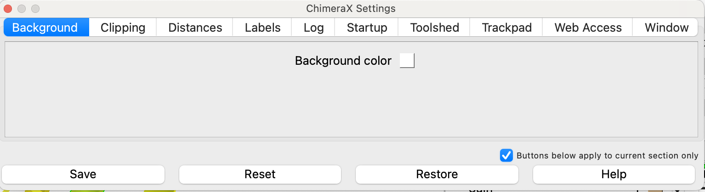
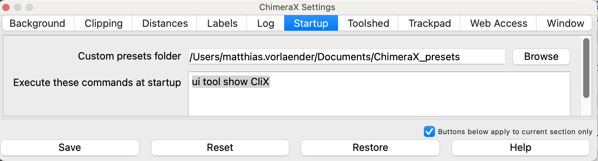
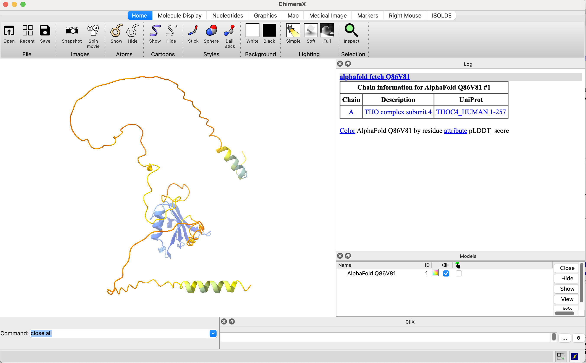
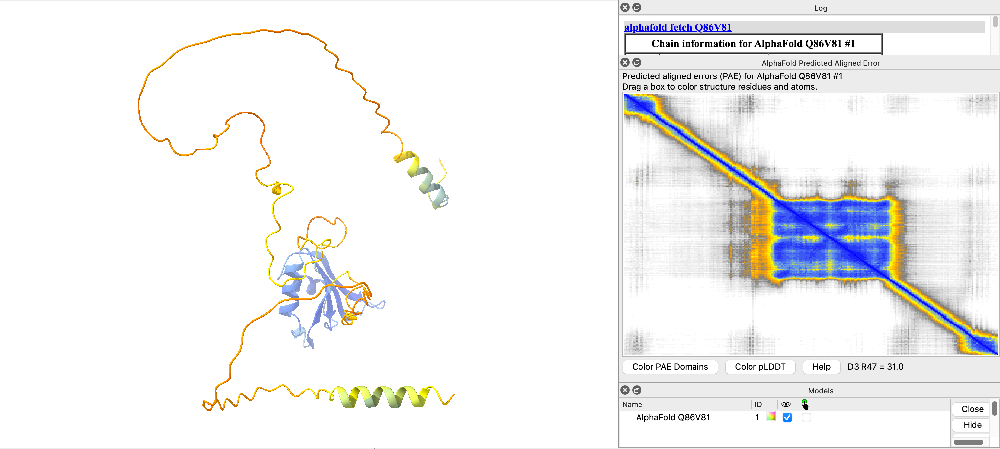
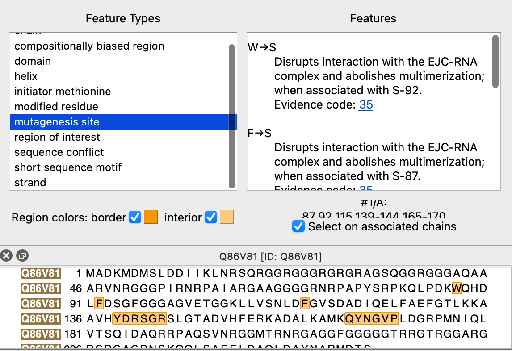
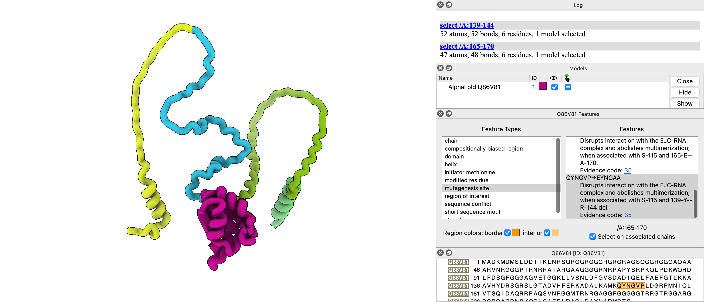
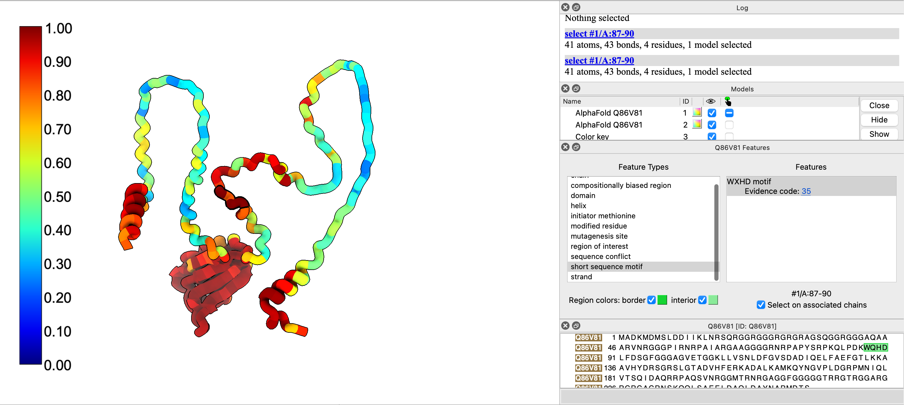

# ChimeraX Tutorial
 

## General info and getting started
ChimeraX is a powerful and versatile program and we can only cover a fraction of its many functionalities! General guidelines for learning are:

- Please use its extensive  [documentation](https://www.cgl.ucsf.edu/chimerax/docs/user/index.html), or search the ChimeraX [mailing list](https://mail.cgl.ucsf.edu/mailman/archives/list/chimerax-users@cgl.ucsf.edu/) for further information. The developers offer excellent user support and are happy to implement newe functionalities upon user suggestions!
- Several tutorials are available [here](https://www.rbvi.ucsf.edu/chimerax/tutorials.html)
- ChimeraX is very actively developed and regularly updated with new features. Try and keep your installation up to to date!
- In addition to core functions, ChimeraX can also run python code. Specific examples are collected [here](https://rbvi.github.io/chimerax-recipes/)
- Another introductory tutorial from Ricardo Righetto (Biocentrum Basel) can be found [here](https://docs.google.com/document/d/15v0dm-J0kwD6oTIsQ2R06c393cfJJe9bh7EM0HY9WkE/edit?tab=t.0#heading=h.mudxcfn4dkjr)

---

# Setting up your ChimeraX

ChimeraX is an extendable program and can be customised to your preferences.

### Browsing and installing extensions

ChimeraX extensions are available through the "Toolshed" and installation is very straightforward. You can access the Toolshed through the toolbar: `Tools/ More tools`. Popular extensions include *Isolde*  for structure refining, *ArtiaX* for electron tomography, and *XMAS* for protein-crosslinking data display. 

> **💡 Tip:**
> The *clix* bundle provides an improved command line tool and offers  auto-complete functionality and live preview of all available options for a command you are typing

### Recommended customisations

You can customise your ChimeraX thorugh the Preference menu (shortcut: `⌘,`). Here are my recommendations to set up once you installed ChimeraX:


### Editing ChimeraX preferences

Open the Preference menu (shortcut: `⌘,`) and change the following:



- **Set the default background color to white**

Most users prefer a white background to match a typical figure display. You can do this in the first tab.


- **Set a folder for custom presets and ChimeraX scripts**
The way structures are displayed is highly customisable, and most users (or labs) tend to prefer their own style. For consistency, these styles should be saved in script files (`my_style.cxc`). Similarly, you should define a color code for your protein of interest in a script if you are preparing figures for a talk or paper. You can quickly apply yoyur favourite styles by placing the `.cxc` files into a preset folder which you specify in the `startup` tab. These preests will then appear in the `Presets` menu in the toolbar. Alternatively you can apply them from the command line with the command `preset my_custom_style`.




Here is an example style script that you could save under my_style.cxc in your Custom preets folder:

```
# Cylinder_preset
graphics selection color black width 5      # Set selection outline to black with width 5

hide                                        # Hide all models initially
show nucleic                                # Show nucleic acid models
hide protein|solvent|H                      # Hide protein, solvent, and hydrogen atoms
surf hide                                   # Hide all surfaces

# Display Styles
style (protein|nucleic|solvent) & @@draw_mode=0 stick  # Display protein, nucleic, and solvent as sticks
size protein stickRadius 0.3                # Set stick radius for proteins
size nucleic stickRadius 0.5                # Set stick radius for nucleic acids

show cartoon                                 # Show cartoon representation for proteins and nucleic acids
cartoon style ~(nucleic|strand) x round      # Set cartoon style to round for non-nucleic/strand elements
cartoon style (nucleic|strand) x rect        # Set cartoon style to rectangular for nucleic acids and strands
cartoon style modeH tube                     # Use tube style for cartoon mode

# Lighting and Camera
lighting shadows false                       # Disable shadows for clearer visualization
light soft                                   # Use soft lighting for a smoother appearance
camera ortho                                 # Set camera to orthographic projection

# Silhouette Settings
graphics silhouettes true                    # Enable silhouettes
graphics silhouettes depthJump 0.1            # Set silhouette depth jump to 0.1

# Centering and Pivot
cofr center showpivot false                  # Center the view and hide pivot point

# Window Configuration
windowsize 800 800                           # Set window size to 800x800 pixels. Very important for making rendered image dimensions reproducible!
                                
# Background and Nucleic Acid Styling
set bgColor white                             # Set background color to white
nucleotides fill                             # Fill nucleotides for better visibility
style nucleic stick                          # Ensure nucleic acids are displayed as sticks
```

- **Define your startup commands**
If you would like certain commands or tools to be launched automatically, you can define them in the `startup` tab as well. For example, I recommend installing the enhanced Command line tool `Clix`, and launch it by outting `ui tool show CliX`  in the `Execute these commands at startup` field 

- **Restore window size when opening sessions** 
In the prefence menu, under `Window`, tick `Resize graphics window on session restore'. This is important for a consistent size of saved images.

---
# Cheat-sheet
## Atom Selection 

Selection specific regions of your model is essential for structural analysis and figure making in ChimeraX. In ChimeraX, selected regions will be displayed with a green outline. There are several ways to select residues:
 - **Through the `Select` menu in the toolbar**. This is good for beginners, but offers only corse control over the selection
 - **Through the sequence viewer**. You can start the sequence viewer under `Tools / Sequence / Show sequence viewer` , or with the command `sequence chain <selection>`. You can then use the mouse to select residues from the sequence viewer, which will be selected in the structure as well
 - **Through the command line (recommended)**. Although it takes a little practice initially, the command line is the most powerful tool in ChimeraX and allows scripting your workflows, which is essential to make figures reproducibly and change them quickly. The following describes the selection syntax 
  
> **💡 Tip:**
> If you are new to the ChimeraX command line and scripting, notice how every action that the log window displays the command for every action that you execute, no matter if through the toolbars or the command line!

## Mini tutorial 1  - inspect pre-computed alphafold 

### Loading the alphafold model and PAE plor

In this tutorial, we are going to look at the mRNA export adaptor ALYREF (also known as THOC4) with the uniprot ID Q86V81. To load the prediction, type:

```alphafold fetch Q86V81```

This will give us this screen:

.

Next, lets associate the PAE plot with this structure, to identify regions that are predicted with high and low confidence, respectively

`open Q86V81 from alphafold_pae structure #1`

This gives us a new window which shows the PAE plot

.

> **💡 Tip:**
> - Note the buttons for coloring the structure by pLDDT score, or by PAE domain! Click the help button for more information!
> - You can select residues in the structure by dragging in the PAE plot!

### Inspect annotated regions 
ChimeraX allows you to select regions that have been functioanlly annotated by uniprot directly. For this, scroll up in the log window until you find the `Chain information for AlphaFold Q86V81 #1` block. Now click on the Uniprot name in the table
 
This will open two new windows: A sequence viewer, and a feature viewer. Clicking on any annotated feature in the Feature viewer will highlight the corresponding residues in the sequence viewer and will select the residues in the structure viewer



### Change the display style
I will next apply one of my custom display presets to the structure, increasing the visibility of the random coil elements

`preset custom "thick ribbons"

The structure now looks like this.


### Coloring by alphafold missense pathogenicity score
The alphafold missense predicted pathogeniocity score is an excellent predictor for functionally imported regions in proteins, and is especially helpful to identify functionally imported region embeeded in disordered stretches. For this, I wrote a small script that will generate a coling script for ChimeraX (available on my github). I executed this command. 

`Generate_AF2_missense_color_map.sh --uniprot Q86V81`

Open the generated ChimeraX script by double clicking or drag and drop. You will a color mapping, that shows region where mutations are likely pathogenic in red, and regions were mutationsa re tolerated in blue:


> **💡 Tip:**
> Note how a short stretch in a disordered region, as well as the two terminal helices and the central folded domains are dark red, potentially indicating the involvement in functionally important protein-protein contacts!


### Investigating regions with high pathogenicity scores

FOr this example, lets focus on the C-terminal region that pops up in our pathogenicity color mapping. For this, lets select the residues either from the sequence viewer

> **💡 Tip:**
>By hovering over a residue, you will see the residue identified pop up

Select the C-terminal helices with high pathogenicity score, either by using the sequence viewer, by clicking control-shift and mouse dragging in the structure window, or with the command `select #1/A:239-257`

After selection, lets name this selection:
`name frozen cterm sel` 

##Blast the selected residues to search for homologs

To search if this C-terminal helix motif is present in other proteins, we can perform a BLAST search directly through ChimeraX. By typing
`blast cterm database alphafold`, we are submitting a blast job to a webserver.

 >**💡 Tip:**
> Click on the command in the log window to see all options, or open the user interface (Tools/Sequence/Blast Protein)
 

### Hierarchical Specifiers

Hierarchical specifiers are the most common way to select items. They have up to four levels:

1. **Model** (`#`)
2. **Chain** (`/`)
3. **Residue** (`:`)
4. **Atom** (`@`)

| Symbol | Level    | Description                                                                  | Example       |
|--------|----------|------------------------------------------------------------------------------|---------------|
| `#`    | Model    | Model number in ChimeraX, separated by dots (e.g., `#1`, `#1.3`).             | `#1`, `#1.3`  |
| `/`    | Chain    | Chain identifier (e.g., `A`, `B`).                                           | `/A`          |
| `:`    | Residue  | Residue number or name (e.g., `:51`, `:glu`).                               | `:51`, `:glu` |
| `@`    | Atom     | Atom name (e.g., `@ca`).                                                     | `@ca`         |

**Notes:**
- If you omit a part, ChimeraX selects everything at that level.
  - `#1` selects all chains in model 1.
  - `#1:100` selects residue 100 in all chains of model 1.
- In the examples below, the syntax is always used together with the `select` commannd, but  many other commands like `color` also directly accept the selection. So you could either say 
  

```
select #1/A
color sel red
```

or

```
color #1/A red
```

---

### Other Ways to Specify Targets

- **Built-in Groups:**  
  Predefined groups like proteins, helices, strands, ligands, solvents, hydrogen bonds, elements, and functional groups.  
  *Tip:* Use `name list builtins true` to see all built-in groups.

- **User-Defined Targets:**  
  Create your own named selections using the `name` command.

- **Attributes:**  
  Select items based on their properties.

- **Zones:**  
  Select items within a certain distance from others.

- **Combinations:**  
  Combine different selection methods using logical operators.

---

## Examples of Selections

- **Select all atoms in model 1:**
  ~~~bash
  select #1
  ~~~

- **Select chain B in model 2:**
  ~~~bash
  select #2/B
  ~~~

- **Select residue 45 in chain A of model 3:**
  ~~~bash
  select #3/A:45
  ~~~

- **Select residues 45 to 55 in chain A of model 3:**
  ~~~bash
  select #3/A:45-55
  ~~~

- **Select all lysine residues in any model:**
  ~~~bash
  select :lys
  ~~~

- **Select alpha carbon atoms in model 1, chain A:**
  ~~~bash
  select #1/A@ca
  ~~~

- **Select multiple atom types:**
  ~~~bash
  select @ca,n,c,o
  ~~~

- **Select lysine residues in chain B only:**
  ~~~bash
  select #1/B:lys
  ~~~

- **Select all backbone atoms in a protein:**
  ~~~bash
  select @ca,n,c,o
  ~~~

---

## Combining Selections

You can use logical operators to combine selections:

- **OR (`,`)**:
  - Select chains A and B in model 1:
    ~~~bash
    select #1/A,B
    ~~~
  - Select residues 10 or 20 in model 1:
    ~~~bash
    select #1:10,20
    ~~~

- **NOT (`~`)**:
  - Select everything except nucleic acids:
    ~~~bash
    select ~nucleic
    ~~~

- **AND (`&`)**:
  - Select all nucleic acids in model 1:
    ~~~bash
    select #1 & nucleic
    ~~~
  - Select all residues in model 1 except nucleic acids:
    ~~~bash
    select #1 &~ nucleic
    ~~~

---

## Selecting by Distance (Zones)

Use the `select zone` command to select items within a certain distance from others.

### How to Use

~~~bash
select zone ref-spec cutoff [other-spec] [extend true|false] [residues true|false]
~~~

- **ref-spec**: The reference items to measure from.
- **cutoff**: Distance in Ångströms.
- **other-spec** *(optional)*: Items to select near `ref-spec`. Defaults to all.
- **extend** *(optional, default: false)*: Include `ref-spec` in the selection if `true`.
- **residues** *(optional, default: false)*: Select whole residues if any atom is within the zone.

### Examples

- **Select protein atoms within 4.5 Å of any ligand:**
  ~~~bash
  select zone ligand 4.5 protein
  ~~~

- **Select atoms within 8 Å of model #1.2:**
  ~~~bash
  select zone #1.2 8
  ~~~

- **Include entire residues within 8 Å of model #1.2:**
  ~~~bash
  select zone #1.2 8 residues true
  ~~~

- **Include reference items in selection:**
  ~~~bash
  select zone #1/A:50 5 extend true
  ~~~
  Explanation: The selection will cintain all atoms within 5 Å around residue 50 in chain A of model #1, as well as the residue 50 itseld

---

For more details, check the [ChimeraX select command documentation](https://www.cgl.ucsf.edu/chimerax/docs/user/commands/select.html#zone).

---

## Keyboard Shortcuts to modify selections

- **Up Arrow** – Broaden the selection
- **Down Arrow** – Narrow the selection
- **Right/Left Arrow** – Invert selection within selected models
- **Shift + Right/Left Arrow** – Invert selection in all models

For more information, see the [ChimeraX Atom Specification documentation](https://www.cgl.ucsf.edu/chimerax/docs/user/commands/atomspec.html).

---

## Naming Selections

Use the `name` command to create labels for selections, making future commands easier.

### How to Use

~~~bash
name [frozen] target-name spec
~~~

- **frozen** *(optional)*: Makes the name refer to the exact items selected at the time, even if the structure changes.
- **target-name**: A label starting with a letter, followed by letters, numbers, `_`, `+`, or `-`.
- **spec**: The selection to name.

### Examples

1. **Dynamic Target for Transmembrane Residues 34-64 in Chain A:**
   ~~~bash
   name tm1 /A:34-64
   ~~~
   *Usage:*
   ~~~bash
   color tm1 medium blue
   ~~~
   *Explanation:* `tm1` always refers to residues 34-64 in chain A, even if new models are added. So if you open a new model after you defined the name, the command 'color tm1 medium blue' will color **both** models

2. **Static Target for All Leucine Residues:**
   ~~~bash
   name frozen leucines :leu
   ~~~
   *Usage:*
   ~~~bash
   color leucines yellow
   ~~~
   *Explanation:* `leucines` refers only to the leucine residues present when it was defined. So if you open a new model after the name was generated, `color leucines yellow` will only affect the model that was open when you first generated the name!

3. **Static Target Based on Current Selection:**
   ~~~bash
   select ligand :<5.5
   ~select solvent
   name frozen pocket sel
   ~~~
   *Usage:*
   ~~~bash
   color pocket red
   ~~~
   *Explanation:* `pocket` refers to atoms within 5.5 Å of any ligand, excluding solvent, as selected initially.

### Managing Named Targets

- **List all user-defined targets:**
  ~~~bash
  name list
  ~~~
  *Tip:* Add `builtins true` to also list built-in targets.

- **Delete a specific target:**
  ~~~bash
  name delete target-name
  ~~~

- **Delete all user-defined targets:**
  ~~~bash
  name delete all
  ~~~

---

## Matchmaker Command

The `matchmaker` command aligns and superimposes protein or nucleic acid structures by:

1. **Sequence Alignment:** Matching the sequences of the structures.
2. **Structural Fitting:** Aligning the structures based on the matched sequences.

### Basic Usage

~~~bash
matchmaker #model_to_align to #reference_model
~~~

### Examples

- **Align Model 2 to Model 1:**
  ~~~bash
  matchmaker #2 to #1
  ~~~

- **Align Models 3, 4, and 5 to Model 6:**
  ~~~bash
  matchmaker #3-5 to #6
  ~~~

### Key Options

- **pairing:** How chains are paired for alignment.
  - `bb` (default): Best matching chains.
  - `sc`: Specify chains in both structures.
  - `sb`: Specify a chain in the reference and find the best match in the other structure.

- **matrix:** Substitution matrix for sequence alignment.
  - `BLOSUM-62` (default for proteins)
  - `PAM-150`
  - `NUCLEIC` (for nucleic acids)

- **alg:** Alignment algorithm.
  - `nw` (default): Needleman-Wunsch

---

## Additional Information

- **Saving Targets:**  
  User-defined targets are saved within your ChimeraX sessions.

- **Auto-Define Targets:**  
  Add `name` commands to your Startup preferences to define targets automatically when ChimeraX starts.

For more information, visit the [ChimeraX name command documentation](https://www.cgl.ucsf.edu/chimerax/docs/user/commands/name.html).
